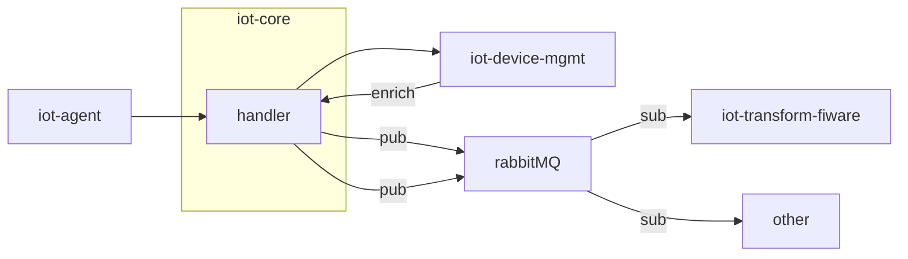

# iot-core
A service for handling core functionality in the IoT platform. Enriches messages with metadata such as position and environment.

[](https://github.com/diwise/iot-agent/blob/main/LICENSE)

# Design



## Dependencies  
 - [iot-device-mgmt](https://github.com/diwise/iot-device-mgmt)
 - [RabbitMQ](https://www.rabbitmq.com/)

# Build and test

## Build
```bash
docker build -f deployments/Dockerfile . -t diwise/iot-core:latest
```
## Test
Testing is best done using unit tests. For integration testing the preferred way is to use `docker-compose.yaml` found in repository [diwise](https://github.com/diwise/diwise) 

# Configuration
## Environment variables
```json
"RABBITMQ_HOST": "<rabbit mq hostname>"
"RABBITMQ_PORT": "5672"
"RABBITMQ_VHOST": "/"
"RABBITMQ_USER": "user"
"RABBITMQ_PASS": "bitnami"
"RABBITMQ_DISABLED": "false"
"DEV_MGMT_URL": "http://iot-device-mgmt:8080", 
"OAUTH2_TOKEN_URL": "http://keycloak:8080/realms/diwise-local/protocol/openid-connect/token",
"OAUTH2_CLIENT_ID": "diwise-devmgmt-api",
"OAUTH2_CLIENT_SECRET": "<client secret>",
```
## CLI flags
none
-

## Configuration files
none

# Links
[iot-core](https://diwise.github.io/) on diwise.github.io

