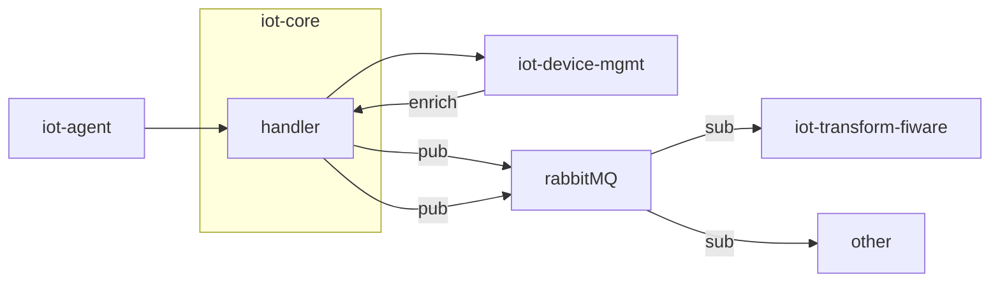

# iot-core

A service for handling core functionality in the IoT platform. Enriches messages with metadata such as position and environment.

[](https://github.com/diwise/iot-agent/blob/main/LICENSE)

# Design


```mermaid
flowchart LR
    iot-agent-->handler
    handler --> iot-device-mgmt -- enrich --> handler
    handler --pub--> rabbitMQ --sub--> iot-transform-fiware
    handler --pub--> rabbitMQ --sub--> other
    subgraph iot-core
        handler   
    end 
```

## Dependencies  
 - [iot-device-mgmt](https://github.com/diwise/iot-device-mgmt)
 - [RabbitMQ](https://www.rabbitmq.com/)

# Build and test

## Build
```bash
docker build -f deployments/Dockerfile . -t diwise/iot-core:latest
```
## Test
Testing is best done using unit tests. For integration testing the preferred way is to use `docker-compose.yaml` found in repository [diwise](https://github.com/diwise/diwise) 

# Configuration
## Environment variables
```json
"RABBITMQ_HOST": "<rabbit mq hostname>"
"RABBITMQ_PORT": "5672"
"RABBITMQ_VHOST": "/"
"RABBITMQ_USER": "user"
"RABBITMQ_PASS": "bitnami"
"RABBITMQ_DISABLED": "false"
"DEV_MGMT_URL": "http://iot-device-mgmt:8080", 
"OAUTH2_TOKEN_URL": "http://keycloak:8080/realms/diwise-local/protocol/openid-connect/token",
"OAUTH2_CLIENT_ID": "diwise-devmgmt-api",
"OAUTH2_CLIENT_SECRET": "<client secret>",
```
## CLI flags
 - `functions` - Configuration file for functions (default `/opt/diwise/config/functions.csv`)

## Configuration files
 - `functions.csv` (default `/opt/diwise/config/functions.csv`) - Required at startup, defines the function registry.

## Faktisk konfiguration (kod ar facit, HARM-002)
Precedens: default < miljovariabel < CLI-flagga.

| Variabel | Default | Notering |
| --- | --- | --- |
| `SERVICE_PORT` | `8080` | Enda HTTP-servern binds mot `:SERVICE_PORT`; ingen separat `LISTEN_ADDRESS` eller kontrollserver i nulaget |
| `DEV_MGMT_URL` | (kravs) | Las med `GetVariableOrDie` |
| `MEASUREMENTS_URL` | (kravs) | Las med `GetVariableOrDie` |
| `OAUTH2_TOKEN_URL` | (kravs) | Las med `GetVariableOrDie` |
| `OAUTH2_CLIENT_ID` | (kravs) | Las med `GetVariableOrDie` |
| `OAUTH2_CLIENT_SECRET` | (kravs) | Las med `GetVariableOrDie` |
| `OAUTH2_REALM_INSECURE` | `false` | `true` stanger av TLS-verifiering for klienterna |
| `POSTGRES_*` | se `database.LoadConfiguration` | `POSTGRES_HOST`, `POSTGRES_PORT` (5432), `POSTGRES_DBNAME` (`diwise`), `POSTGRES_USER`, `POSTGRES_PASSWORD`, `POSTGRES_SSLMODE` (`disable`) |
| `RABBITMQ_*` | se `messaging.LoadConfiguration` | T.ex. `RABBITMQ_HOST`, `RABBITMQ_PORT`, `RABBITMQ_DISABLED` |

Halsa: `GET /health` pa samma port som API:t, svarar alltid 200. Ingen liveness/readiness-prob mot beroenden och ingen `LOG_LEVEL`-styrning i nulaget.

Routern ar `github.com/diwise/service-chassis/pkg/infrastructure/net/http/router` (samma som ovriga API-tjanster). Det tidigare CORS-middlewaren (`rs/cors`) ar borttaget; tjansten satter inga `Access-Control-*`-headers i nulaget.

# Links
[iot-core](https://diwise.github.io/) on diwise.github.io

