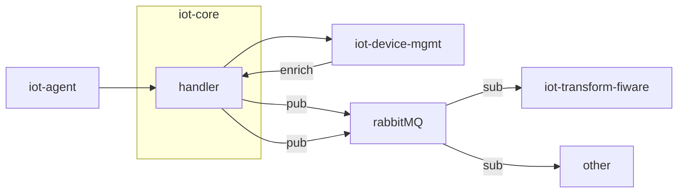

# iot-core

A service for handling core functionality in the IoT platform. Enriches messages with metadata such as position and environment.

[](https://github.com/diwise/iot-agent/blob/main/LICENSE)

# Design


```mermaid
flowchart LR
    iot-agent-->handler
    handler --> iot-device-mgmt -- enrich --> handler
    handler --pub--> rabbitMQ --sub--> iot-transform-fiware
    handler --pub--> rabbitMQ --sub--> other
    subgraph iot-core
        handler   
    end 
```

## Dependencies
 - [iot-device-mgmt](https://github.com/diwise/iot-device-mgmt) (`DEV_MGMT_URL`, enhetsslagning och berikning)
 - Measurements-API via iot-events (`MEASUREMENTS_URL`, aggregerade matvarden)
 - [RabbitMQ](https://www.rabbitmq.com/) (kommando fran agent, `message.accepted`, `function.updated`)
 - PostgreSQL/TimescaleDB (funktionsregister och historik)
 - OAuth2/OIDC-tokenutgivare (`OAUTH2_TOKEN_URL`, klientautentisering mot device management och measurements)

# Build and test

## Build
```bash
docker build -f deployments/Dockerfile . -t diwise/iot-core:latest
```
## Test
Testing is best done using unit tests. For integration testing the preferred way is to use `docker-compose.yaml` found in repository [diwise](https://github.com/diwise/diwise)

Database integration tests skip by default. Set `IOT_TEST_DATABASE=1` with a running TimescaleDB (see `deployments/` or the diwise repository) to run them; without a reachable database the opt-in run fails instead of passing silently. Never point test runs at a production database.

# Configuration
## Environment variables
```json
"RABBITMQ_HOST": "<rabbit mq hostname>"
"RABBITMQ_PORT": "5672"
"RABBITMQ_VHOST": "/"
"RABBITMQ_USER": "user"
"RABBITMQ_PASS": "bitnami"
"RABBITMQ_DISABLED": "false"
"DEV_MGMT_URL": "http://iot-device-mgmt:8080",
"MEASUREMENTS_URL": "http://iot-events:8080",
"OAUTH2_TOKEN_URL": "http://keycloak:8080/realms/diwise-local/protocol/openid-connect/token",
"OAUTH2_CLIENT_ID": "diwise-devmgmt-api",
"OAUTH2_CLIENT_SECRET": "<client secret>",
"OAUTH2_REALM_INSECURE": "false",
"SERVICE_PORT": "8080",
"LISTEN_ADDRESS": "0.0.0.0",
"CONTROL_PORT": "8000",
"ENABLE_TRACING": "true",
"LOG_LEVEL": "debug",
"POSTGRES_HOST": "url to postgresql database"
```
## CLI flags
 - `functions` - Configuration file for functions (default `/opt/diwise/config/functions.csv`)
 - `loglevel` - Set the log level (`debug` default; `info`, `warn`/`warning`, `error`)

## Configuration files
 - `functions.csv` (default `/opt/diwise/config/functions.csv`) - Required at startup, defines the function registry.

## Faktisk konfiguration (kod ar facit, HARM-002)
Precedens: default < miljovariabel < CLI-flagga.

| Variabel | Default | Notering |
| --- | --- | --- |
| `SERVICE_PORT` | `8080` | Publika API-servern binds mot `LISTEN_ADDRESS:SERVICE_PORT` |
| `LISTEN_ADDRESS` | `0.0.0.0` | Bindadress for bade publik server och kontrollserver (CORE-004) |
| `CONTROL_PORT` | `8000` | Kontrollservern binds mot `LISTEN_ADDRESS:CONTROL_PORT` (CORE-004) |
| `ENABLE_TRACING` | `true` | Endast exakt `true` aktiverar tracing-wrappern pa publika servern (CORE-004) |
| `LOG_LEVEL` | `debug` | `debug`, `info`, `warn`/`warning`, `error`; okand varde ger `debug`. Kan även sättas med `-loglevel` (CORE-006) |
| `DEV_MGMT_URL` | (kravs vid startup) |  |
| `MEASUREMENTS_URL` | (kravs vid startup) |  |
| `OAUTH2_TOKEN_URL` | (kravs vid startup) |  |
| `OAUTH2_CLIENT_ID` | (kravs vid startup) |  |
| `OAUTH2_CLIENT_SECRET` | (kravs vid startup) |  |
| `OAUTH2_REALM_INSECURE` | `false` | Endast exakt `true` stanger av TLS-verifiering for klienterna |
| `POSTGRES_HOST` | (tom) |  |
| `POSTGRES_PORT` | `5432` |  |
| `POSTGRES_DBNAME` | `diwise` |  |
| `POSTGRES_USER` | (tom) |  |
| `POSTGRES_PASSWORD` | (tom) |  |
| `POSTGRES_SSLMODE` | `disable` |  |
| `POSTGRES_MAX_CONNS` | `10` |  |
| `POSTGRES_MIN_CONNS` | `2` |  |
| `POSTGRES_MAX_CONN_LIFETIME` | `30m` |  |
| `POSTGRES_MAX_CONN_IDLE_TIME` | `5m` |  |
| `POSTGRES_HEALTH_CHECK_PERIOD` | `30s` |  |
| `RABBITMQ_HOST` | (tom, kravs om inte avstangd) |  |
| `RABBITMQ_PORT` | `5672` |  |
| `RABBITMQ_VHOST` | `/` |  |
| `RABBITMQ_USER` | `user` |  |
| `RABBITMQ_PASS` | `bitnami` |  |
| `RABBITMQ_DISABLED` | `false` |  |
| `RABBITMQ_INIT_TIMEOUT` | `10` | Sekunder |

Halsa (CORE-005): liveness och namngivna readiness-stubbar (`rabbitmq`, `timescale`) bor pa kontrollservern (`LISTEN_ADDRESS:CONTROL_PORT`) och returnerar alltid OK utan natverksanrop. Sökvägar (runner-standard): `GET /health`, `GET /healthz`, `GET /livez`, `GET /readyz`, `GET /readyz/{check}`. Den publika `GET /health` pa `SERVICE_PORT` ar borttagen. **Obligatorisk extern andring:** Kubernetes- och Compose-prober som anvander publik `/health` maste flytta till kontrollserverns sökvägar atomiskt med denna release.

Loggning (CORE-006): `LOG_LEVEL` (`debug` default; `info`, `warn`/`warning`, `error`; okand varde faller tillbaka till `debug`) styrs via env eller `-loglevel`. Strukturerade falt: `trace_id`, `device_id`, `object_id`, `topic`, `function_id`. `device_id` ar det interna ID:t som all data lagras mot; sensorns fysiska ID (`sensor_id`, t.ex. devEUI) finns inte i core och loggas darfor inte har. Sensorpayloads och measurements-svar loggas aldrig rutinmässigt.

Externa Kubernetes- och Compose-definitioner finns inte i detta repo och ar darfor inte inventerade har.

Routern ar `github.com/diwise/service-chassis/pkg/infrastructure/net/http/router` (samma som ovriga API-tjanster). Det tidigare CORS-middlewaren (`rs/cors`) ar borttaget; tjansten satter inga `Access-Control-*`-headers i nulaget.

# Startup

1. Las defaults, miljovariabler och CLI-flaggor (precedens: default < env < CLI).
2. Oppna `functions.csv` (kraver ratt sokvag; tom sokvag betyder tomt registerunderlag).
3. Skapa device management-klient, measurements-klient, messaging-kontext och databasanslutning i `OnInit`. Partiellt misslyckande stanger redan oppnade resurser.
4. Starta messaging och registrera kommandohandlern samt `message.accepted`- och `function.updated`-handlerna i `OnStarting`. Registreringsfel avbryter startup.
5. Servera funktions-API:t pa `SERVICE_PORT` och liveness/readiness-stubbar pa `CONTROL_PORT`.
6. Vid shutdown: stang messaging (stoppar inflode), measurements-klient, device management-klient och storage. Idempotent, varje resurs exakt en gang.

# API

Funktions-API:t (`/api/functions`) ar avsiktligt odokumenterat har: ingen OpenAPI skapas inom harmoniseringen och API:t beskrivs inte som fardigt. Rutt- och modelldokumentation hor till den kommande funktionsutbyggnaden.

# Verification

```bash
gofmt -l cmd/ internal/ pkg/
go test -count=1 ./...
go vet ./...
go build -o /tmp/iot-core ./cmd/...
docker build -f deployments/Dockerfile .
```

Database-backed tests skip explicitly when no PostgreSQL is reachable; unit and contract tests always run. Redovisa hoppade integrationstester uttryckligen; ett tyst godkänt integrationstest räknas inte som verifierat.

# Links
[iot-core](https://diwise.github.io/) on diwise.github.io

